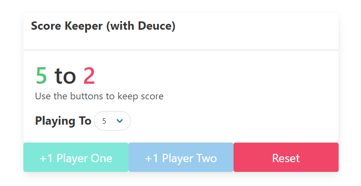
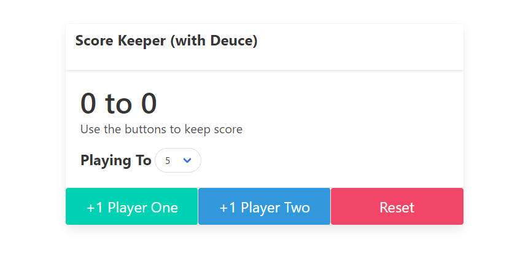
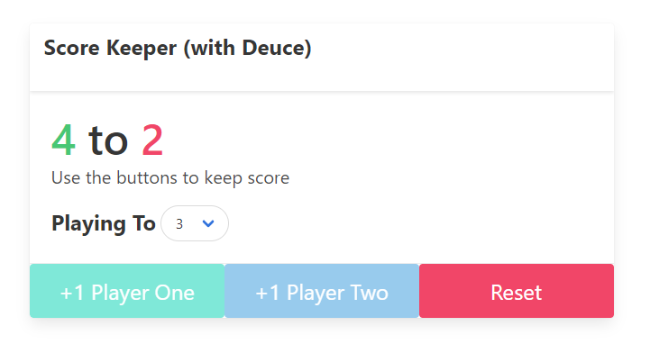

# Score Keeper
TODO: Fill in

## 🖼️ Project Images

    

Winner

See More Images

 

    

ScoreKeeper

    

Deuce

## 🏁 Getting Started
These instructions will get you a copy of the project up and running on your local machine for development and testing purposes.

### Prerequisites
Only a browser is required to run this project locally.

### Running the project
To run/open the project simply open the `index.html` file.

## ⛏️ Built With

- [HTML]() - 
- [Bulma]() - 

## ✍️ Author

- [JakubRichardson](https://github.com/JakubRichardson)